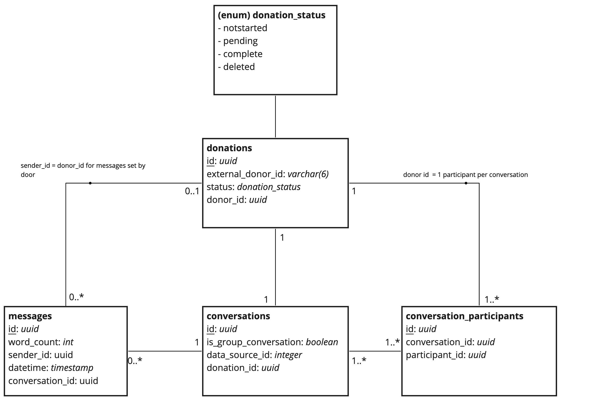

# Dona - Social Data Gathering Platform
Dona is a prototype developed to collect and de-identify Social Data to be later used as 
part of a research effort to diagnose mental illnesses.

## Development Instructions

### Environment variables

The following need to be set up in the environment to run the application
* `APPLICATION_SECRET` Play framework application secret.
* `KALINKA_HOST` The host of the application. Used for cookie domain
* `DATABASE_HOST` Host of Postgres instance
* `DATABASE_PORT` Port of Postgres instance
* `DATABASE_NAME` Name of Postgres database
* `DATABASE_USER` Postgres user
* `DATABASE_PASSWORD` Password for postgres user
* `DONOR_SURVEY_ENABLED` Whether the user should be forwarded to an external survey or not
* `DONOR_SURVEY_LINK` The link to the external survey
* `SOCIAL_DATA_INGESTION_ENABLED` Toggle if data is stored or not

Below is detailed how these variables can be easily set depending on the
environemnt you are running in. 

### Docker (easy start to see things running) 
Dona is packaged in a docker container and has a dependency on 
postgreSQL. 

### SBT Cache Container
Running sbt update takes a long time (~10 mins) so we do not want to do 
this unless something has changed in the sbt dependency chain. In order 
to do this a "cache container" is built. To build this cache container 
run the following.  

```
docker build . --file Dockerfile.cache --tag dona.tf.uni-bielfeld.de/hc-rp-kalinka-cache:1 
```

### docker-compose

In order build and start the application locally using docker you can run

```
docker-compose up
```
or if you want to make sure the image is rebuilt you can add the 
`--build` flag. 
You also might consider using background mode, if you plan to leave the 
process up while you are not working on it. 
```
docker-compose up &
```

This will bring up the Dona service and a postgres database for it to 
connect to. You can now access the [application](localhost:9000)

For a deeper undersanding of the docker compose setup take a look at the
 yaml file [.docker-compose.yml](.docker-compose.yml)

### Running without docker (better for development)

#### NPM

NPM is required to build the javascript code.  
 
Steps:  
1. install npm (currently v6 is used as part of node v12) 
Get the latest version of npm through the usual way for your system or
check out the [npmjs side](https://www.npmjs.com/package/npm) or, as is 
done in docker, you can run: 
```
curl -sL https://deb.nodesource.com/setup_12.x | bash - && apt-get install -y nodejs
```

2. npm install

Run the `npm install` command to install the dependencies required.

3. install and run browserify

[browserify](https://github.com/browserify/browserify) is used for 
having a node-style `require()` import in browser. In this project it is 
usedTo create two required files:   
* `bundle.js` - de-identification, parsing and show the data to the user 
* `plot.js` - show the user their results using plotly.js 

To generate these files run the following:

```
npm install -g browserify
mkdir public/javascripts
browserify javascripts/main.js > ./public/javascripts/bundle.js
browserify javascripts/thanks.js > ./public/javascripts/plot.js
```

These files are imported into the html using a normal script tag. 

#### SBT

This is the [Interactive Build Tool](https://www.scala-sbt.org/) and is 
used to package the scala code and assemble everything into a jar file 
that will run in the docker container.

### local config

In order to use developer specific settings locally, add a file `/conf/local.conf` with 
settings specific to your local development setup. This file is on the gitignore list, 
so it won't interfere with others.

Example that overrides default development database settings:

```
# local config

include "development.conf"

# example, add your local database details
db.default {
  url="jdbc:postgresql://localhost:5432/kalinka"
  username="postgres"
  password="postgres"
}

```
Then run

```
sbt -Dconfig.resource=local.conf run
```

### In other environments

For other environments you can inject different configuration files for
example: 

```
sbt -Dconfig.resource=development.conf run
```

### Testing

There are tests for both scala and javascript code. Coverage is not at
100% so there is room for improvement but this give some confidence when
making changes.

To run the tests run the following commands:
```
npm test
sbt test
``` 

## Kubernetes

Kubernetes files are provided in [./deploy](the deploy) directory. The 
templates need to be injected with the variables from [./deploy/config](the config)
for the desired environment.

It would be a nice improvement to migrate this to use [helm](helm.sh) in 
order to simplify this process. 

## Application Details

### How the application works?

Upon reaching the landing page the user is given information on the
research. The next page gives the user instructions on how to download 
their data for facebook and WhatsApp. This should be done before 
continuing. If the user selects to take part in the study they are 
shown the digital consent that must be agreed to. This is stored in a
cookie that must be present for later steps. At this point a donor_id is
created and stored in database with the status 'pending'

The user is now forwarded to soscisurvey where they need to complete a 
questionnaire. Once complete they come back to the upload page of our application where they
can select the platforms that they want to upload data for. 

After selecting the files the user will see a visualisation of the 
anonymized data. No data at this stage has been sent to the server.

Once the user selects to send the data it is transferred in the back-end
of the application and stored in database. The donation status is 
updated to 'completed'

The user will see a summary of the data that they have uploaded. 
 
###  Database information

Kalinka owns a Postgres database, which it uses to track donations as
they progress through the system.



The external_id is used to connect the data with questionnaires stored 
in soscisurvey.

The `status` field can have values `notstarted`, `pending`, `complete` and `deleted`.
These have the following meanings:

|Status    |Meaning|
|----------|-------|
|NotStarted|Donation for an offline consent donor who has not started the donation process. (This status is currently unused.)|
|Pending   |Donation for a user who has accepted the T&C (online consent) or entered their ID (offline consent) on the website but has not uploaded their data.|
|Complete  |Donation that has been completed, with the deidentified data uploaded to Sagittarius.|
|Deleted   |Donation that has been deleted on the user's request. (This status is currently unused.)|
